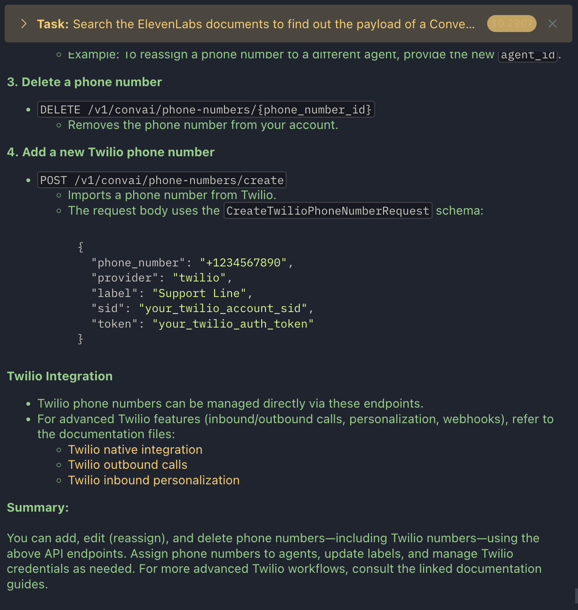

# ElevenLabs Documentation MCP Server

A Model Context Protocol (MCP) server for interacting with [ElevenLabs documentation](https://elevenlabs.io/docs/overview) at [https://github.com/elevenlabs/elevenlabs-docs](https://github.com/elevenlabs/elevenlabs-docs). This server provides tools to access and search ElevenLabs documentation and API spec files directly via the Model Context Protocol.



## Overview

This MCP server provides tools to access and search ElevenLabs documentation directly from Claude via the Model Context Protocol. It retrieves documentation from the official ElevenLabs documentation repository and provides structured access to API references and guides.

## Available Tools

The server provides the following tools:

1. **elevenlabs_search_docs**: Search ElevenLabs documentation and API spec files (e.g., asyncapi.yml, openapi.json) based on keywords.
   - Parameters:
     - `query` (required): Search query or keywords
     - `limit` (optional): Maximum number of results to return (default: 10)
     - `linesContext` (optional): Number of context lines to include before and after the match (default: 16)
     - `fullFile` (optional): If true, returns the entire file content for each match (default: false)

2. **elevenlabs_get_doc**: Get specific ElevenLabs document content by path.
   - Parameters:
     - `path` (required): Document path relative to the fern directory

3. **elevenlabs_search_api_files**: Fuzzy search inside ElevenLabs API spec files (e.g., asyncapi.yml, openapi.json) for keywords.
   - Parameters:
     - `query` (required): Search query or keywords
     - `linesContext` (optional): Number of context lines to include before and after the match (default: 16)
     - `fullFile` (optional): If true, returns the entire file content for each match (default: false)

## Setup

### Local Development

1. Clone the repository:
   ```bash
   git clone https://github.com/yourusername/mcp-server-elevenlabs.git
   cd mcp-server-elevenlabs
   ```

2. Install dependencies:
   ```bash
   npm install
   ```

3. Build the project:
   ```bash
   npm run build
   ```

4. Run the server:
   ```bash
   node dist/src/index.js
   ```

### Environment Variables

The server uses the following environment variables:

- `GITHUB_TOKEN` (optional): GitHub personal access token for increased rate limits. If not provided, the server will use unauthenticated GitHub API access with lower rate limits.

### Running with Docker

1. Build the Docker image:
   ```bash
   docker build -t mcp-server-elevenlabs .
   ```

2. Run the container:
   ```bash
   docker run -e GITHUB_TOKEN=your_github_token mcp-server-elevenlabs
   ```

## Usage with Claude Desktop

To use this MCP server with Claude Desktop, add the following configuration to your Claude Desktop settings:

```json
{
  "mcpServers": {
    "elevenlabs-docs": {
      "command": "docker",
      "args": [
        "run",
        "-i",
        "--rm",
        "-e",
        "GITHUB_TOKEN",
        "ghcr.io/monotykamary/elevenlabs-docs-mcp"
      ],
      "env": {
        "GITHUB_TOKEN": "your_github_token_here"
      }
    }
  }
}
```

With this configuration:
1. Claude will automatically start the Docker container when needed
2. The MCP server will have access to your GitHub token (optional, for higher rate limits)
3. The container will be removed when Claude Desktop is closed

To avoid rate limiting issues with GitHub, it's recommended to provide a GitHub personal access token with at least `public_repo` scope.

## Usage Examples

### Example 1: Searching for Documentation and API Specs

```
mcp_elevenlabs_search_docs(query="text to speech tutorial", limit=5, linesContext=8)
```

### Example 2: Getting a Specific Document

```
mcp_elevenlabs_get_doc(path="fern/apis/api/openapi.json")
```

### Example 3: Fuzzy Searching API Spec Files

```
mcp_elevenlabs_search_api_files(query="voice_id", linesContext=4, fullFile=false)
```

## Troubleshooting

- **Rate Limiting**: If you encounter rate limiting issues with the GitHub API, provide a `GITHUB_TOKEN` environment variable.
- **File Not Found**: Ensure that the document path is correct and exists in the ElevenLabs documentation repository.
- **Empty Search Results**: Try using more general search terms or check the spelling of your search query.

## License

MIT
